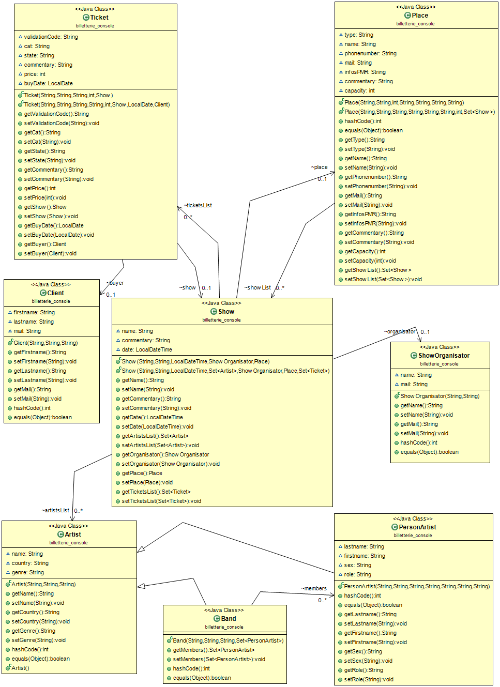

# Devoir de programmation web avancée

Le but de ce devoir est de réaliser une application web de billeterie pour des concerts ou tout autre type d'évènement. Celle-ci à été réalisée à l'aide des technologies JEE servlet et JSP, du frameworks Hibernate et de l'API Jax-RS et tout ceci fonctionne grace à un serveur Tomcat et une base de données MySQL.

## Présentation 

Le model utilisé pour cette application est le suivant : les billets (Classe `Ticket`) font référence à un acheteur (Classe `Client`) et à un évènement (Classe `Show`). Les évènements concernent un lieu d'accueil (Classe `Place`) et un artiste, qu'il soit un groupe (Classe `Band`) ou une personne (Classe `PersonArtist`), et à un organisateur (Classe `ShowOrganisator`).

Ensuite, une API REST à été implémentée pour gérer l'intégralité de ces informations, ainsi que le test et la validation des billets. Toutes ses données sont sauvegardées sur la base de donnée MySQL grâce à Hibernate.Enfin quelques pages de gestion ont été ajoutées elle sont basées sur l'architecture MVC via des servlets et des jsp.

## Hibernate

Les fichiers de configuration pour chacune des classes à sauvegarder ont été générés automatiquement à l'aide d'un plugin Eclipse dédié, puis modifié un à un manuellement. Dans un premier temps, tous les noms de colonnes on été modifiés afin de les rendre plus compréhensibles et pour simplifier le debuggage de la base de données. Ensuite il a fallu régler plusieurs problèmes notament désactiver l'option *lazy* et ajouter l'option pour la suppression en cascade. De plus à cause d'une erreur de nommage de certaines clés étrangères, un temps important à du être consacré au débuggage de l'application, il se trouve en fait que certaines clés étrangère avait simplement le même nom que la colonne qu'elle référençait dans l'autre table.
