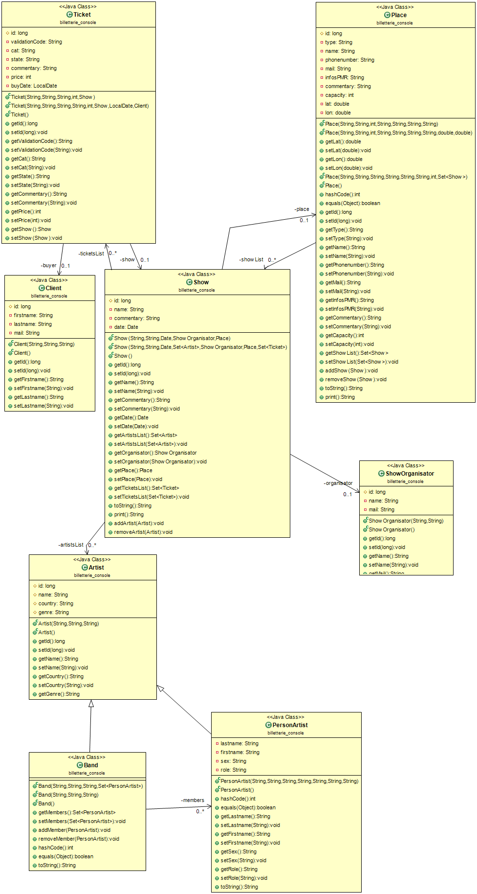

# Devoir de programmation web avancée

Le but de ce devoir est de réaliser une application web de billeterie pour des concerts ou tout autre type d'évènement. Celle-ci à été réalisée à l'aide des technologies JEE servlet et JSP, du frameworks Hibernate et de l'API Jax-RS et tout ceci fonctionne grace à un serveur Tomcat et une base de données MySQL.

## Présentation 

Le model utilisé pour cette application est le suivant : les billets (Classe `Ticket`) font référence à un acheteur (Classe `Client`) et à un évènement (Classe `Show`). Les évènements concernent un lieu d'accueil (Classe `Place`) et un artiste, qu'il soit un groupe (Classe `Band`) ou une personne (Classe `PersonArtist`), et à un organisateur (Classe `ShowOrganisator`).

Ensuite, une API REST à été implémentée pour gérer l'intégralité de ces informations, ainsi que le test et la validation des billets. Toutes ses données sont sauvegardées sur la base de donnée MySQL grâce à Hibernate.Enfin quelques pages de gestion ont été ajoutées elle sont basées sur l'architecture MVC via des servlets et des jsp.

## Hibernate

Les fichiers de configuration pour chacune des classes à sauvegarder ont été générés automatiquement à l'aide d'un plugin Eclipse dédié, puis modifié un à un manuellement. Dans un premier temps, tous les noms de colonnes on été modifiés afin de les rendre plus compréhensibles et pour simplifier le debuggage de la base de données. Ensuite il a fallu régler plusieurs problèmes notament désactiver l'option *lazy* et ajouter l'option pour la suppression en cascade. De plus à cause d'une erreur de nommage de certaines clés étrangères, un temps important à du être consacré au débuggage de l'application, il se trouve en fait que certaines clés étrangère avait simplement le même nom que la colonne qu'elle référençait dans l'autre table.

Un problème que j'ai rencontré lors de la réalisation de cette API est le cas des classes avec des références croisés (par exemple `Show` et `Place`), en effet lorsque l'on tente d'ajouter un objet `Show` avec une référence vers un objet `Place`, il faudrait ajouter directement ajouter dans l'objet JSON/XML envoyé l'autre objet, mais cela crée un nouvel objet au lieu d'en reférencer un déjà existant, de plus à cause du référencement dans les deux sens cela crée une boucle infinie. Le solution serai de permettre uniquement l'ajout d'un nouvel objet sans référence vers un autre puis permettre d'ajouter une référence simplement en demandant l'identifiant de l'objet à référencer.

[Fichier de configuration Hibernate](src/hibernate.cfg.xml)

## API REST

Même si cela n'était pas demandé dans le sujet, l'intégralité des données à été rendu accessible et modifiable via une API REST, cela avait pour but de rendre plus facilement réalisable l'intégration avec d'autre webservices dédiés à la musique, ainsi que de permettre d'ajouter et supprimer facilement des entrées dans la base de données de l'application. Pour chaque classe du modèle de base, une classe "controleur" à été écrite.

[Package comprennant les controleurs de l'API REST](src/billetterie_interfaceREST)

## Les pages d'administration et d'accès utilisateur

Cette partie étant la dernière à avoir été réalisée, je n'ai pas pu effectuer l'ensemble des pages demandées. Seuls 2 "Exemples" on été réalisés pour la gestion des artistes et des lieux d'accueil. 

Ces pages fonctionnent de la manière suivante : la page principale est une liste (soit de tous les artistes soit de tous les lieux) avec pour chaque entrée la possibilité de la modifier, de la supprimer, ainsi qu'une plus générale pour ajouter un nouvel élément. La suppression supprime l'élément et actualise la page, la modification permet d'accèder à un formulaire pré-remplis avec les valeurs de chaque champs de l'objet à modifier et l'ajout propose simplement un formulaire vide.

Cette architecture permet donc de proposer une utilisation simple mais en revanche implique un nombre important de servlets pour gerer chaque évènement. 

Pour les lieux d'accueil, une option à aussi été ajouté à la liste pour trouver une station de vélo libre service à proximité via l'API JCDecaux.

L'implémentation des pages manquantes n'a pas été réalisé pour le moment par manque de temps mais consistera simplement en un copier/coller et une légère réécriture des pages déjà implémentées.

[Package contenant les servlets](src/billetterie_servlets)

# Conclusion et améliorations à apporter au projet. 

Grâce à ce projet j'ai pu apprendre à développer et mettre en place des webservices avancés avec l'aide de JEE et de certain framework, il m'a permis de bien mieux comprendre le fonctionnement notament du framework Hibernate et de l'API Jax-RS et m'a permis d'en apprendre plus sur les bonnes pratiques à avoir et surtout des mauvaises pratiques à éviter. En particulier il aurait été sans doute plus simple de ne pas inserer de référence croisées dans les classes de base, cela aurait évité bien des problèmes avec la base de données. De même il est très important lors de la configuration d'Hibernate de faire très attention au noms de colonnes et à la gestion des clés étrangères. Pour ce qui est de l'API REST, il serait bénéfique de simplifier les possibilités d'ajout de nouvelles entrées dans la base de donnée et permettre la référence d'un objet déjà existant via son identifiant. 

Enfin pour ce qui est des pages de gestions certaines seraient plutôt simple à ajouter, mais il serai aussi important d'ajouter des options de recherche d'évènement ou d'artiste (et effectuer la recherche en utilisant les possibilités du langage SQL) ainsi que de permettre aux administrateurs de générer automatiquement des billets pour chaque évènement.
